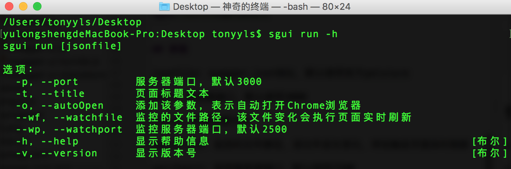

# sgui
命令行工具，用于支持个性化启动Swagger-UI (sg 是 Swagger的缩写)

## 命令行使用
安装命令

```bash
npm install -g sgui
```

查看有哪些参数

```bash
sgui run -h
```


例子一: 打开官方默认 Swagger-UI

```bash
sgui run
```

例子二：指定 swagger.json，页面标题，监控文件

```bash
sgui run http://localhost:8080/swagger.json -t JMMSTitle --wf /Users/tonyyls/Desktop/test.txt 

```


##nodejs中使用

安装命令

```bash
npm install sgui --save
```

```javascript
const sgui = require('sgui');
sgui.launch(options);
```

**参数options**

jsonfile: swagger.json地址

port: 服务器端口，默认 3000

title: 页面标题文本

watchfile: 监控的文件路径，该文件发生变化，将会触发页面实时刷新

watchport: 监控服务器端口，默认 2500
